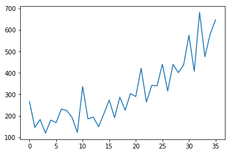
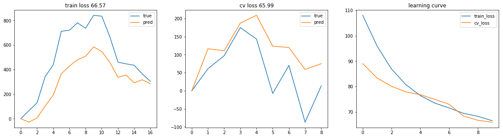

# Time Series Predictions

> Play with time

## 1. Shampoo Sales Prediction

> `ShampooSales.ipynb`

sales goes like this, need to predict according to history.



A wonderful tutorial to convert time series prediction to supervised problem: [Time Series Forecasting as Supervised Learning](https://machinelearningmastery.com/time-series-forecasting-supervised-learning/)

### Result

best fit before overfitting:



### Stateful LSTM

Core code

```
model = Sequential()
model.add(LSTM(4, batch_input_shape=(BATCH_SIZE, X.shape[1], X.shape[2]), stateful=True))
model.add(Dropout(0.5))
model.add(Dense(1, activation='linear'))

model.compile(loss='mse', optimizer='adadelta')

# way 1
for i in range(EPOCHS):
    model.fit(X, y, epochs=1, shuffle=False, batch_size=BATCH_SIZE)
    model.reset_states()

# way 2
class StatusResetCallback(Callback):
    def on_batch_begin(self, batch, logs={}):
        self.model.reset_states()

model.fit(X, y, epochs=EPOCHS, batch_size=BATCH_SIZE,
		shuffle=False, callbacks=[StatusResetCallback()])
```

## 2. Stateful LSTM in Keras

> `StatefulLSTM.ipynb`

Learning from [Stateful LSTM in Keras](http://philipperemy.github.io/keras-stateful-lstm/) by Philippe Remy, which is a wonderful and simple tutorial. The composed dataset is simple and clean:

```
     X           y
1 0 0 ... 0      1
0 0 0 ... 0      0
0 0 0 ... 0      0
1 0 0 ... 0      1
1 0 0 ... 0      1
...
```

Obviously, if the first of X seq is 1, y = 1, else 0. We will see if the 1 status will pass along to predict the result.

### Stateless LSTM Can't Converge

```
model = Sequential()
model.add(LSTM(LSTM_UNITS, input_shape=X_train.shape[1:], return_sequences=False, stateful=False))
model.add(Dense(1, activation='sigmoid'))
model.compile(loss='binary_crossentropy', optimizer='adam', metrics=['accuracy'])
```

### Stateful LSTM

it works. Talk is cheap, see the code.
